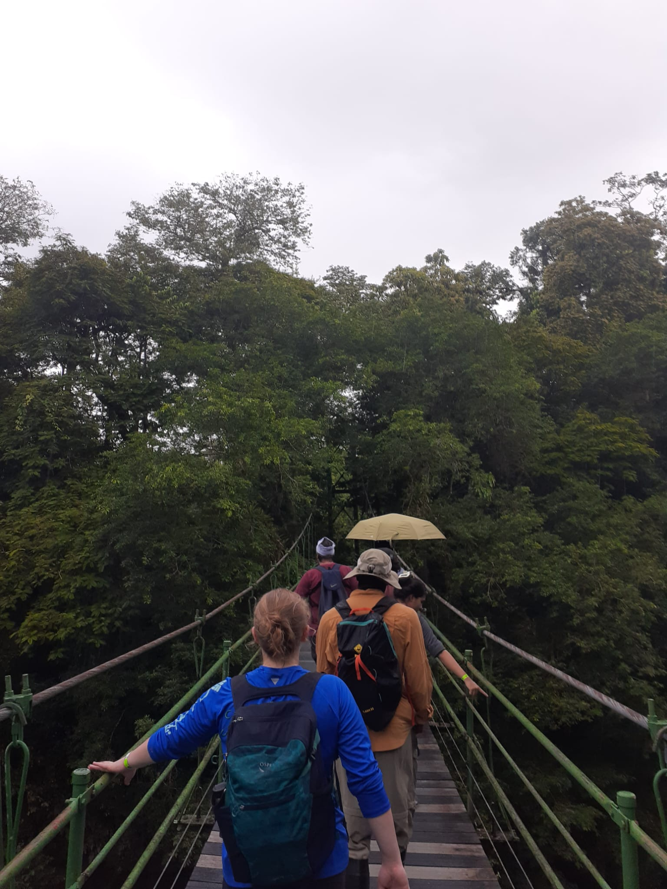
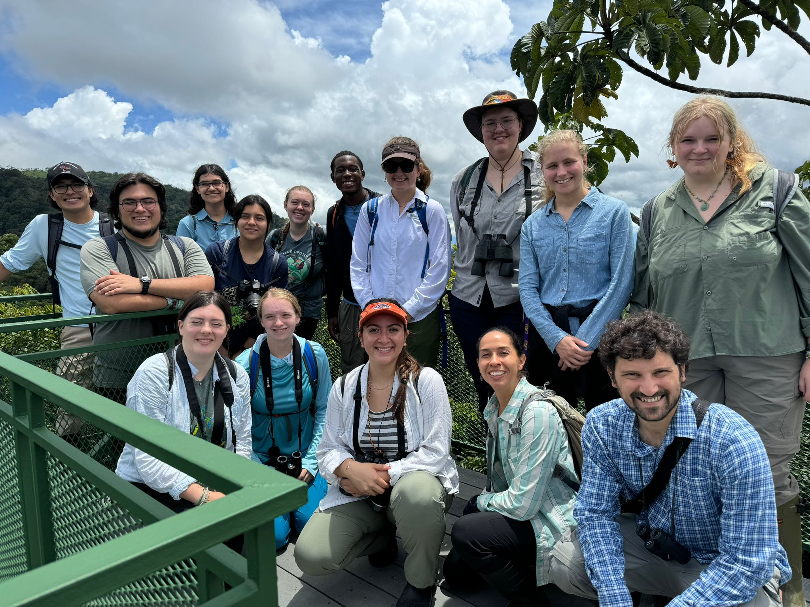
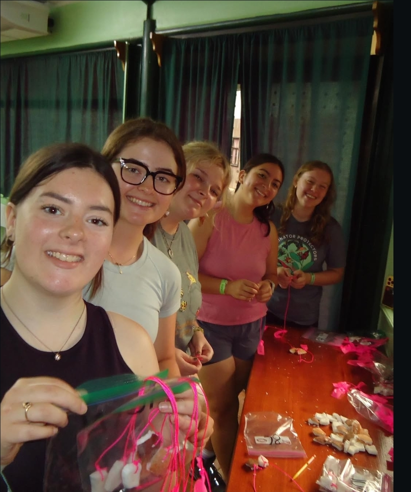
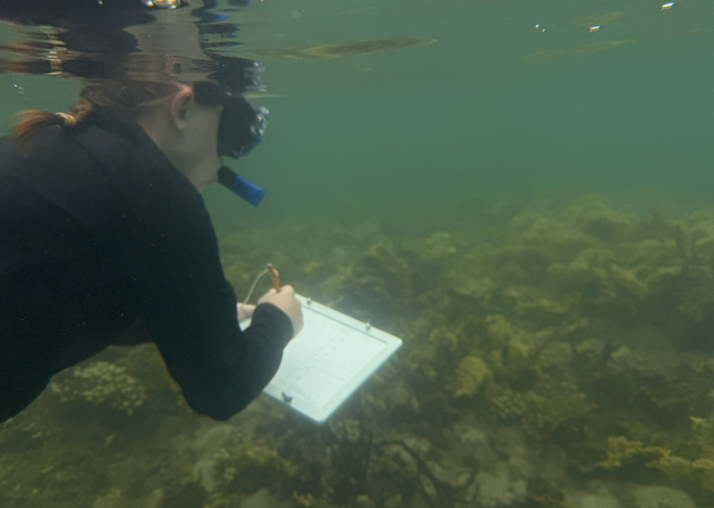
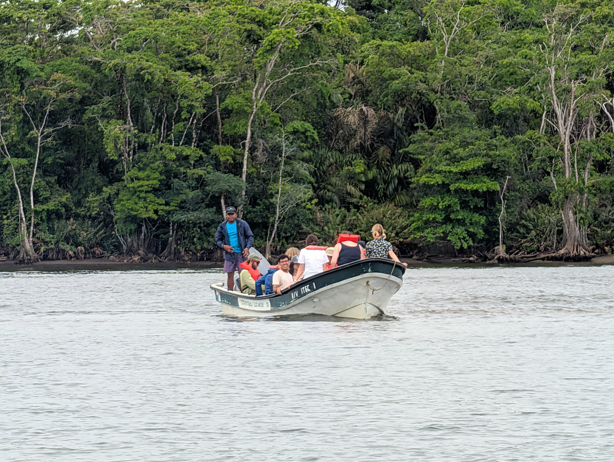
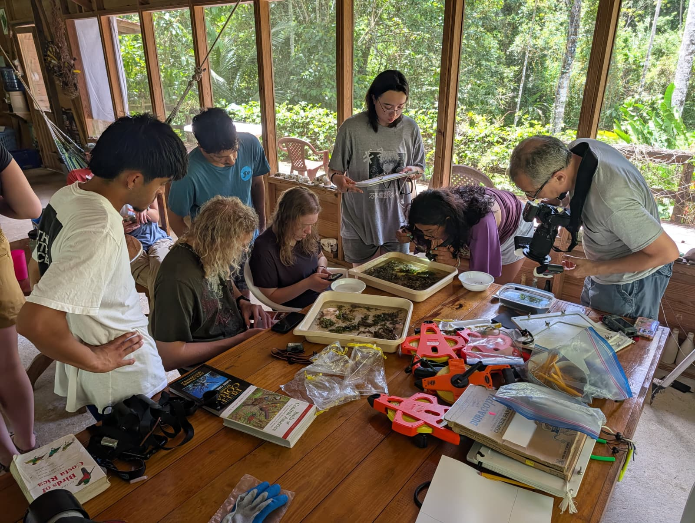
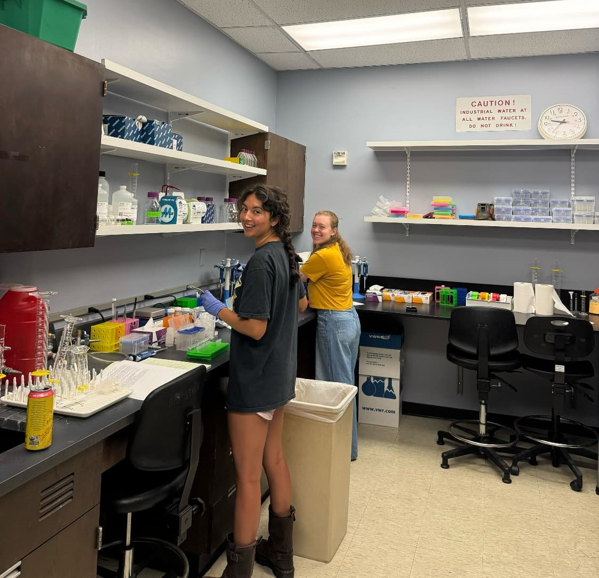

### Organization for Tropical Studies (OTS)

Summer Tropical Biology Program: Introduction to the fundamental principles of tropical biology and the natural history of tropical plants and animals in Costa Rica. I conducted an independent and collaborative research projects at three field stations, collecting data out in the field, and presenting our results.

{width="180"} {width="320"} {width="201"}

### Tropical Marine Field Biology in Panama

BIO 4550L/5550L Field Biology (Panama Tropical Marine Ecology) class. Included was an 11-day research trip to Panama, with a week-long stay at ITEC field station in Bocas Del Toro, Panama.

{width="267"} {width="252"} {width="253"}

### Undergraduate Research Assistant

In the summer of 2025 I learned proper DNA extractions techniques for genomic analysis as well as data organization, collection, and entry.

{width="286"}

### Presentations

**April 2025**

Identifying genomic regions under parallel selection for commensal nesting behavior in Oceanic swallows. Poster Presentation at California State Polytechnic University, Pomona College of Science Research Symposium

**June 2025**

Genome-wide divergence between migratory and non-migratory welcome swallows (*Hirundo neoxena*). Poster presentation at the annual meeting of the Society for the Study of Evolution, Athens, GA.

**March 2026**

Genome-wide divergence between migratory and non-migratory welcome swallows (*Hirundo neoxena*). Oral presentation at California State Polytechnic University, Pomona RSCA Conference.

**April 2026**

Genome-wide divergence between migratory and non-migratory welcome swallows (*Hirundo neoxena*). Poster Presentation at California State Polytechnic University, Pomona College of Science Research Symposium

Not so Damsel: Defensive chase behavior in damselfish. Rene Romo, Kieran Murray, Valentina Eppers. Poster Presentation at California State Polytechnic University, Pomona College of Science Research Symposium
